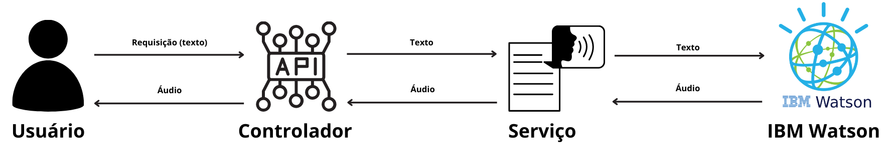
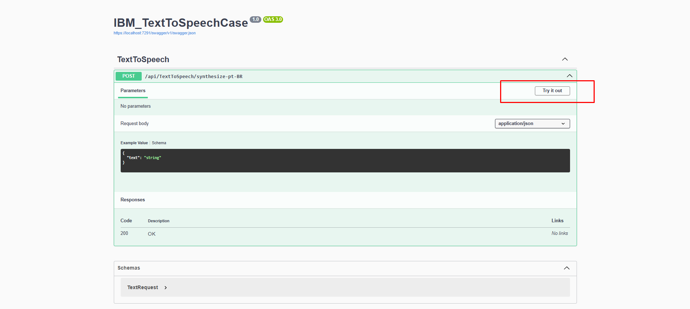
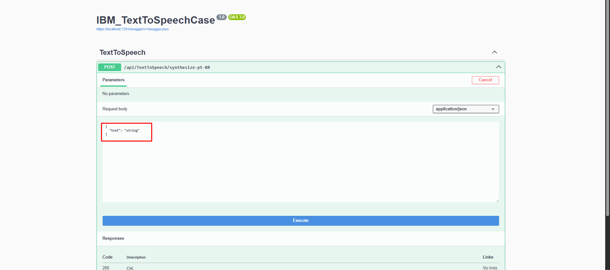
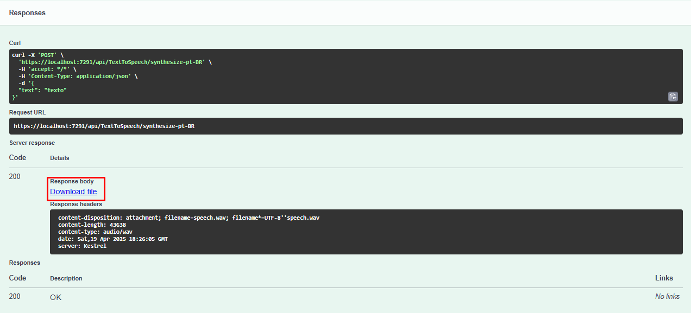
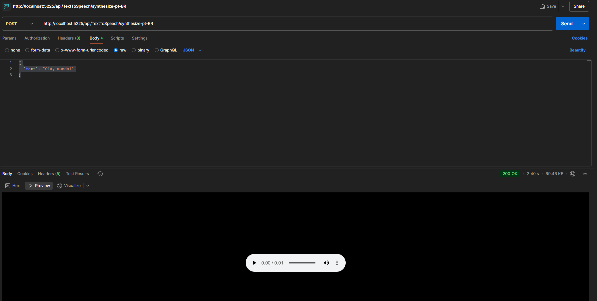

# 🗣️ IBM Text to Speech API (.NET 8)

Este projeto é uma API REST desenvolvida em .NET 8 que utiliza o serviço **Text to Speech** da **IBM Cloud** para converter textos em áudio. O serviço recebe uma string com o texto desejado e retorna um arquivo de áudio no formato `.wav`, sintetizado com uma voz natural em português brasileiro.

<br/><br/>

## 📁 Funcionamento do projeto

O projeto segue uma arquitetura simples e bem organizada, separando responsabilidades entre partes distintas. Isso facilita a manutenção, reutilização de código e testes. As duas principais partes são:

### 1. **Serviço** – `Services/TextToSpeechService.cs`
É parte do código que contém a lógica da função que transforma um texto em um áudio.

- Contém a classe `TextToSpeechService`:
  - Dentro do construtor dessa classe fazemos a autenticação das credenciais da API utilizando o SDK do IBM Cloud
  - Temos também o método `SynthesizeTextToSpeech`, que chama o método `Synthesize` do namespace  `IBM.Watson.TextToSpeech.v1`, que sintetiza um texto (string) em áudio (wav);

### 2. **Controlador** – `Controllers/TextToSpeechController.cs`
É a parte do código que contém o endpoint principal do servidor e controla as requisições dos usuários.

- Define o endpoint `POST /api/TextToSpeech/synthesize-pt-BR`:
  - Recebe uma requisição JSON contendo o texto a ser convertido.
  - Valida o texto para garantir que não está vazio ou inválido.
  - Chama o serviço `TextToSpeechService` para gerar o áudio e retorna o arquivo `.wav` como resposta.
  - Em caso de erro, retorna uma mensagem apropriada com o código HTTP correspondente.

O diagrama abaixo ilustra resumidamente o fluxo de dados entre os componentes da aplicação, desde a requisição do usuário até a resposta com o áudio:



<br/><br/>

## ▶️ Instruções de uso

### ✅ Pré-requisitos

- [.NET 8 SDK](https://dotnet.microsoft.com/en-us/download)
- Uma conta na [IBM Cloud](https://cloud.ibm.com/registration) com o serviço **Text to Speech** provisionado
- [Postman](https://www.postman.com/) 
- (Desejável) [Visual Studio 2022 Community Edition](https://visualstudio.microsoft.com/pt-br/vs/community/)
 

<br/>

### 🧪 Passo a passo

1. **Clone o repositório**
   ```bash
   git clone https://github.com/Ioneda22/ibm-tts-case.git
   cd ibm-tts-case

2. **Colocar a credencias da API em `appsettings.json`**  
   O caminho para o arquivo em questão é `ibm-tts-case\IBM_TextToSpeechCase\IBM_TextToSpeechCase\appsettings.json`
    ```csharp
    {
    "Logging": {
        "LogLevel": {
            "Default": "Information",
            "Microsoft.AspNetCore": "Warning"
        }
    },
    "IBMTextToSpeechCredentials": {
        "ApiKey": "INSERT_YOUR_API_KEY_HERE", //Inserir aqui sua chave
        "Url": "INSERT_YOUR_API_URL_HERE" //Inserir aqui sua url
    },
    "AllowedHosts": "*"
    }

3. **Abrir o arquivo `.sln` (`ibm-tts-case\IBM_TextToSpeechCase\IBM_TextToSpeechCase.sln`) no Visual Studio e rodar o programa**

   Após rodar a solução, você deverá ser redirecionado para a interface do Swagger no seu navegador, que terá essa cara:
     

4. **Colocar o texto desejado no corpo da requisição**
   
   
5. **Fazer download do arquivo contendo o áudio**
      

<br/>

### 🚀 Simular a requisição usando o Postman

1. **Repetir os passos 1. e 2. citados anteriormente**

2. **Rodar o comando `dotnet run` no terminal dentro da pasta `ibm-tts-case\IBM_TextToSpeechCase\IBM_TextToSpeechCase` (pasta que contém o arquivo `IBM_TextToSpeechCase.csproj`)**

3. **Postman**
   
   Criar uma nova requisição do tipo `POST` no Postman com a URL `http://localhost:5225/api/TextToSpeech/synthesize-pt-BR` e colocar no corpo da requisição seu texto:
   ```json
   {
    "text": "Insira seu texto aqui"
   }
  

<br/>

### ❗OBSERVAÇÕES❗

Caso as portas `http:5225` e `https:7291` estejam sendo utilizadas no seu computador, será necessário inserir outra porta livre no arquivo `launchSettings.json`(`ibm-tts-case\IBM_TextToSpeechCase\IBM_TextToSpeechCase\Properties`)
```csharp
"http": {
  "commandName": "Project",
  "dotnetRunMessages": true,
  "launchBrowser": true,
  "launchUrl": "swagger",
  "applicationUrl": "http://localhost:{Insira sua porta aqui}",
  "environmentVariables": {
    "ASPNETCORE_ENVIRONMENT": "Development"
  }
},
"https": {
  "commandName": "Project",
  "dotnetRunMessages": true,
  "launchBrowser": true,
  "launchUrl": "swagger",
  "applicationUrl": "https://localhost:{Insira sua porta aqui};http://localhost:{Insira sua porta aqui}",
  "environmentVariables": {
    "ASPNETCORE_ENVIRONMENT": "Development"
  }
}, 


